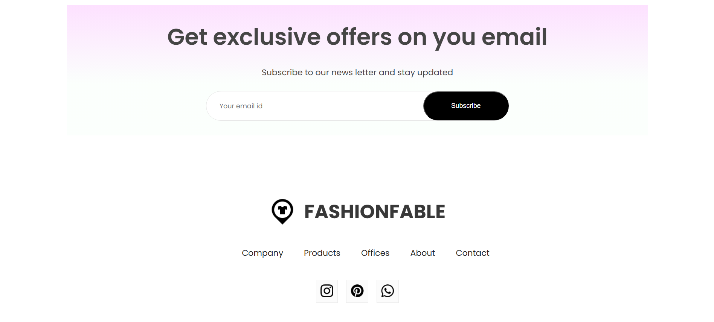

# E-Commerce Store - MERN Stack

## Table of Contents

-   [Project Overview](#project-overview)
-   [Technologies Used](#technologies-used)
-   [Features](#features)
-   [Installation](#installation)
-   [Usage](#usage)
-   [Folder Structure](#folder-structure)
-   [API Endpoints](#api-endpoints)
-   [Contributing](#contributing)
-   [License](#license)

## Project Overview

This is a full-stack e-commerce application built using the MERN (MongoDB, Express.js, React.js, Node.js) tech stack. The application allows users to browse products across different categories (Men, Women, Kids), manage their shopping cart, and perform user authentication through login and signup functionalities.

## Technologies Used

-   **MongoDB**: NoSQL database for storing product and user data.
-   **Express.js**: Web framework for Node.js to build the backend API.
-   **React.js**: Frontend library for building user interfaces.
-   **Node.js**: JavaScript runtime for server-side development.
-   **React context**: State management for handling cart and user authentication.
-   **Bootstrap**: CSS framework for responsive design.
-   **JWT (JSON Web Tokens)**: For secure user authentication.

## Features

-   User authentication (Login/Signup)
-   Product browsing by categories (Men, Women, Kids)
-   Shopping cart management (Add, Remove, Update items)
-   Product details pa+ge
-   User profile management

## Homepage

## Men's category page

# Product details page

